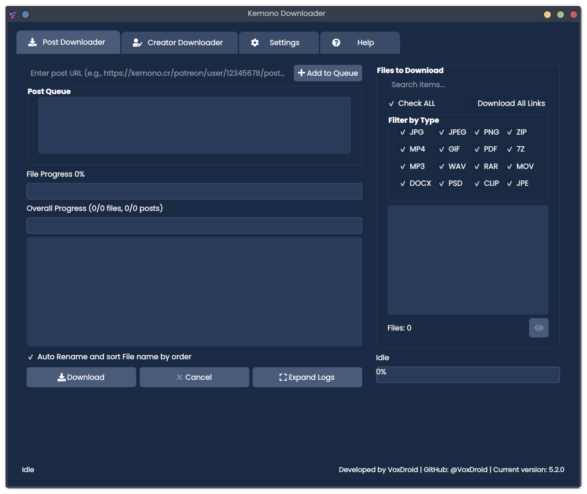
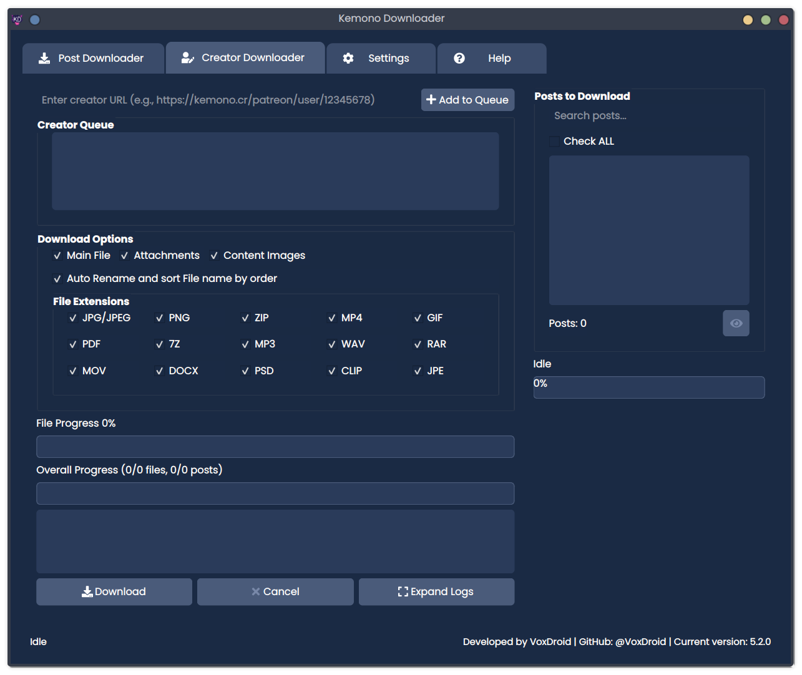
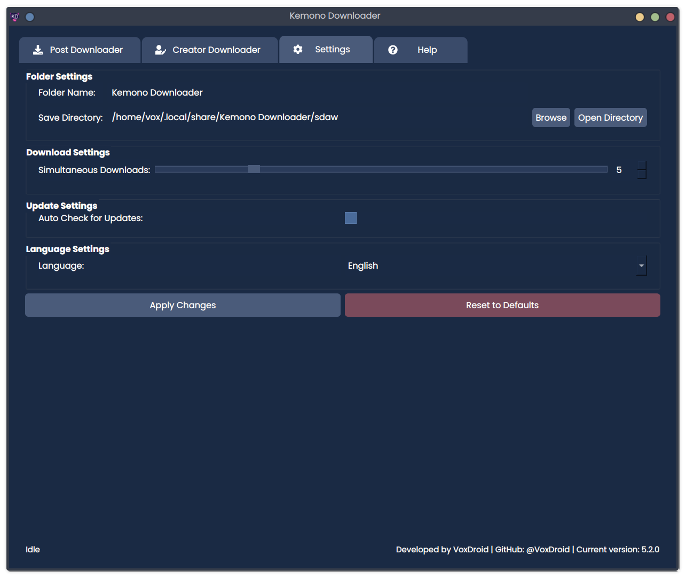

<h1 align="center">Kemono.su Downloader</h1>

<div align="center">
  
</div>

<br>

<div align="center">
  <a>
    
  </a>
</div>

<br>

<div align="center">
  <a href="https://github.com/VoxDroid/KemonoDownloader/blob/main/LICENSE">
    
  </a>
  <a href="https://github.com/VoxDroid/KemonoDownloader/releases">
    
  </a>
  <a href="https://github.com/VoxDroid/KemonoDownloader">
    
  </a>
  <a href="https://github.com/VoxDroid/KemonoDownloader/forks">
    
  </a>
  <a href="https://github.com/VoxDroid/KemonoDownloader/commits/main">
    
  </a>
  <a href="https://github.com/VoxDroid/KemonoDownloader/issues">
    
  </a>
  <a href="https://www.python.org/downloads/">
    
  </a>
  <a href="https://github.com/VoxDroid/KemonoDownloader">
    
  </a>
  <a href="https://github.com/VoxDroid/KemonoDownloader/releases">
    
  </a>
  <a>
    
  </a>
  <a href="https://voxdroid.github.io/KemonoDownloader/" target="_blank">
    
  </a>
  <a href="https://github.com/VoxDroid/KemonoDownloader/blob/main/README/README_JP.md" target="_blank">
    
  </a>
  <a href="https://github.com/VoxDroid/KemonoDownloader/blob/main/README/README_KR.md" target="_blank">
    
  </a>
</div>

<br>
<p align="center">
  <a href="https://ko-fi.com/O4O6LO7Q1" target="_blank">
    
  </a>
</p>
<br>
<hr style="border: 1px dashed #4A6B9A; margin: 20px 0;">

<div align="center">
 <a href="https://sourceforge.net/p/kemonodownloader/"></a>
 <br>
 <br>
 <a href="https://sourceforge.net/projects/kemonodownloader/files/latest/download"></a>
 <br>
 <br>
 <a href="https://sourceforge.net/projects/kemonodownloader/files/latest/download"></a>
 <a href="https://sourceforge.net/projects/kemonodownloader/files/latest/download"></a>
 <a href="https://sourceforge.net/projects/kemonodownloader/files/latest/download"></a>
 <a href="https://sourceforge.net/projects/kemonodownloader/files/latest/download"></a>
</div>

<br>

<hr style="border: 1px dashed #4A6B9A; margin: 20px 0;">

Welcome to **Kemono Downloader**, a versatile Python-based desktop application built with PyQt6, designed to download content from [Kemono.su](https://kemono.su). This tool enables users to archive individual posts or entire creator profiles from services like Patreon, Fanbox, and more, supporting a wide range of file types with customizable settings and advanced features.

## Important Notices

### Disclaimer

KemonoDownloader is a tool designed for personal and educational use only, to assist users in downloading content from Kemono.su. The maintainers of this project **do not condone or support the unauthorized distribution of copyrighted material**. Users are solely responsible for ensuring they have the legal right to access and download content from Kemono.su, and for complying with all applicable laws, as well as the terms of service of the original platforms from which the content originates (e.g., Patreon, Pixiv Fanbox, Gumroad).

**Misuse of this tool to infringe on creators’ rights, violate copyright laws, or breach terms of service is strictly prohibited.** The maintainers are not liable for any misuse of KemonoDownloader or any consequences arising from its use, including but not limited to legal action, financial loss, or damage to third parties.

### Ethical Use Guidelines

KemonoDownloader interacts with content from Kemono.su, which may include material originally posted on paywalled platforms like Patreon, Pixiv Fanbox, and Gumroad. Many creators on these platforms rely on paid subscriptions for their livelihood. Downloading and redistributing their content without permission can harm their ability to continue creating.

We strongly encourage users to:
- Use KemonoDownloader responsibly and only for content you have the legal right to access.
- Support creators directly by subscribing to their official channels on platforms like Patreon, Pixiv Fanbox, or Gumroad.
- Avoid redistributing downloaded content, as this may violate copyright laws and harm creators.

### Risks and Limitations

- **Legal Risks**: Downloading content from Kemono.su may violate copyright laws or the terms of service of the original platforms. Users assume all legal risks associated with using this tool.
- **Dependency on Kemono.su**: KemonoDownloader relies on Kemono.su, which has a history of inconsistent updates and downtime. If Kemono.su becomes unavailable, this tool will lose its functionality.
- **Rate Limits and Errors**: Kemono.su may impose rate limits or other restrictions that affect download performance. The maintainers cannot guarantee uninterrupted access to Kemono.su’s content.

## Community Standards

We are committed to fostering a welcoming and respectful community around KemonoDownloader. Please read our [Code of Conduct](CODE_OF_CONDUCT.md) and [Security Policy](SECURITY.md) to understand the standards we expect from all contributors and users. Key points include:
- Respecting the intellectual property rights of creators.
- Refraining from using KemonoDownloader to engage in illegal activities, such as unauthorized distribution of copyrighted material.
- Reporting any violations of the Code of Conduct or security issues to the maintainers via [izeno.contact@gmail.com](mailto:izeno.contact@gmail.com) or by opening a private issue labeled "Code of Conduct Violation" or "Security Violation."

## Table of Contents
- [Important Notices](#important-notices)
  - [Disclaimer](#disclaimer)
  - [Ethical Use Guidelines](#ethical-use-guidelines)
  - [Risks and Limitations](#risks-and-limitations)
- [Community Standards](#community-standards)
- [Features](#features)
- [Installation](#installation)
- [Usage](#usage)
  - [Getting Started](#getting-started)
  - [Post Downloader Tab](#post-downloader-tab)
  - [Creator Downloader Tab](#creator-downloader-tab)
  - [Settings Tab](#settings-tab)
  - [Help Tab](#help-tab)
- [Screenshots](#screenshots)
- [Releases](#releases)
- [Support](#support)
- [Contributing](#contributing)
- [Security](#security)
- [License](#license)
- [Dependencies](#dependencies)
- [Special Thanks & Contributors](#special-thanks--contributors)
  - [Contributor Profiles](#contributor-profiles)
  - [Project Star Statistics](#project-star-statistics)
  - [Star History](#star-history)

## Features
- **Post Downloading**: Easily download files from specific Kemono.su posts using their URLs.
- **Creator Archiving**: Bulk download all posts and files from a creator's profile with a single click.
- **File Type Support**: Handle images (JPG, PNG, GIF), videos (MP4), archives (ZIP, 7Z), PDFs, and more.
- **Concurrent Downloads**: Adjust the number of simultaneous downloads (1-10) for optimal performance.
- **File Deduplication**: Prevent redundant downloads using URL hashes.
- **Image Previews**: Preview images before downloading to verify content.
- **Detailed Logging**: Track progress and troubleshoot issues with an in-app console.
- **Cross-Platform UI**: Built with PyQt6 for a modern, intuitive interface compatible with multiple operating systems.
- **Media Playback**: Preview videos and GIFs with built-in playback controls (play, pause, seek, volume).
- **Multilingual Support**: Switch between English, Japanese, Korean and Simplified Chinese languages dynamically.
- **Automatic Updates**: Check for new versions on startup with optional notifications.

## Installation
Kemono Downloader is now packaged using [Briefcase](https://briefcase.readthedocs.io/), making it easier to run or distribute as a native application across platforms. You can either build from source or use pre-compiled binaries where available.

### Building with Briefcase (All Platforms)
1. Ensure you have **Python 3.9+** installed on your system (Windows, macOS, Linux).
2. Clone this repository:
   ```bash
   git clone https://github.com/VoxDroid/KemonoDownloader.git
   cd KemonoDownloader
   ```
3. Install Briefcase and dependencies:
   ```bash
   python -m pip install -r requirements.txt
   ```
4. Initialize the Briefcase project (if not already set up):
   ```bash
   briefcase create
   ```
5. Build the application:
   - **Windows**: `briefcase build windows`
   - **macOS**: `briefcase build macos`
   - **Linux**: `briefcase build linux`
   - **General**: `briefcase build` *(Recommended)*
6. Run the application:
   - **Windows**: `briefcase run windows`
   - **macOS**: `briefcase run macos`
   - **Linux**: `briefcase run linux`
   - **General**: `briefcase dev` *(Recommended)*
   - **Note**: An internet connection is required to fetch content from Kemono.su.

### Pre-Compiled Binaries
- **Windows**: Download the latest `.exe` (portable) or `.msi` (installer) tagged with [**`W`**] for windows, from the [Releases page](https://github.com/VoxDroid/KemonoDownloader/releases). Run the msi installer or use the portable version for no-setup runs.
- **macOS**: Download the latest universal `.dmg` (x86_64 and Apple Silicon) tagged with [**`M`**] for MacOS, from the [Releases page](https://github.com/VoxDroid/KemonoDownloader/releases). Open the DMG, drag the app to Applications, and launch it.
- **Linux**: Download the latest `.rpm` (for Fedora/Red Hat), `.deb` (for Debian/Ubuntu), or `.pkg.tar.zst` (for Arch/Pacman) tagged with [**`L`**] for Linux, from the [Releases page](https://github.com/VoxDroid/KemonoDownloader/releases). Run the installer and launch the app.

## Usage
Upon launching, you’ll see an introductory screen with a "Launch" button. Click it to enter the main interface, featuring four tabs: **Post Downloader**, **Creator Downloader**, **Settings**, and **Help**. The in-app Help tab contains a comprehensive user manual.

### Getting Started
- The application creates default directories (`Downloads`, `Cache`, `Other Files`) in the specified save location.
- Ensure an active internet connection to access Kemono.su content.
- Explore the Help tab for detailed instructions and troubleshooting tips.

### Post Downloader Tab
- **Purpose**: Download files from individual Kemono.su posts.
- **How to Use**:
  1. Enter a post URL (e.g., `https://kemono.su/patreon/user/123456789/post/123456789`) in the "Enter post URL" field.
  2. Click "Add to Queue" to add it to the list.
  3. Click the eye icon to view files, filter by type (e.g., JPG, ZIP), and select files to download.
  4. Click "Download" to start, and monitor progress with the progress bars and console.

### Creator Downloader Tab
- **Purpose**: Bulk download content from a creator's profile.
- **How to Use**:
  1. Enter a creator URL (e.g., `https://kemono.su/patreon/user/123456789`) in the "Enter creator URL" field.
  2. Click "Add to Queue" to add it to the list.
  3. Click the eye icon to fetch posts, configure options (Main File, Attachments, Content Images), and select posts.
  4. Click "Download" to begin, and track progress via the interface.

### Settings Tab
- **Purpose**: Customize the application’s behavior.
- **How to Use**:
  1. Set the folder name and save directory for downloads.
  2. Adjust simultaneous downloads (1-10) using the slider or spinbox.
  3. Click "Apply Changes" to save.

### Help Tab
- **Purpose**: Access the embedded user manual.
- **How to Use**: Navigate to the Help tab to read detailed guides, examples, and support information.

## Screenshots

Here are previews of the main tabs in Kemono Downloader:

<table align="center">
  <tr>
    <td align="center">
      
      <br>
      <strong>Post Downloader Tab</strong>
    </td>
    <td align="center">
      
      <br>
      <strong>Creator Downloader Tab</strong>
    </td>
  </tr>
  <tr>
    <td align="center">
      
      <br>
      <strong>Settings Tab</strong>
    </td>
    <td align="center">
      <!-- Placeholder for potential fourth screenshot -->
    </td>
  </tr>
</table>

## Releases
- **Windows**: Pre-compiled `.exe` available in the [Releases section](https://github.com/VoxDroid/KemonoDownloader/releases).
- **macOS**: Pre-compiled universal `.dmg` (x86_64 and Apple Silicon) available in the [Releases section](https://github.com/VoxDroid/KemonoDownloader/releases).
- **Linux**: Pre-compiled `.rpm` (for Fedora/Red Hat), `.deb` (for Debian/Ubuntu), or `.pkg.tar.tsz` (for Arch/Pacman) available in the [Releases page](https://github.com/VoxDroid/KemonoDownloader/releases).
- Check release notes for details on new features, bug fixes, and version updates.
- The Briefcase-built Python source remains the primary method, supporting all platforms with proper setup.

## Support
For ways to get help, report issues, or support the project’s development, please see the [Support page](SUPPORT.md).

## Contributing
Kemono Downloader is open-source, and contributions are encouraged! Please read our [Contributing Guidelines](CONTRIBUTING.md), [Code of Conduct](CODE_OF_CONDUCT.md), and [Security Policy](SECURITY.md) before submitting issues or pull requests. Use the appropriate [issue templates](.github/ISSUE_TEMPLATE/) for reporting bugs, suggesting features, or other contributions, and the [Pull Request template](.github/PULL_REQUEST_TEMPLATE.md) for code submissions.

## Security
If you discover a security vulnerability, please follow our [Security Policy](SECURITY.md) by emailing [izeno.contact@gmail.com](mailto:izeno.contact@gmail.com) or using the [Security Report issue template](.github/ISSUE_TEMPLATE/security_report.yml) for non-sensitive issues.

## License
This project is licensed under the [MIT License](LICENSE). Use, modify, and distribute it freely per the license terms.

## Dependencies
To build from source, install the following Python packages:
- `PyQt6` (for the GUI)
- `requests` (for HTTP requests)
- `beautifulsoup4` (for HTML parsing)
- `qtawesome` (for icons)
- `briefcase` (for packaging the app)

Create a `requirements.txt` file with these dependencies and run `pip install -r requirements.txt`.

---

## Special Thanks & Contributors

We’re incredibly grateful to our amazing contributors who have helped shape **Kemono Downloader** into what it is today. 

## Contributor Profiles

<p align="left">
  <a href="https://github.com/VoxDroid">
    
  </a>
  <a href="https://github.com/detached64">
    
  </a>
  <a href="https://github.com/gitwawa1">
    
  </a>
</p>


## Project Star Statistics

Check out how **Kemono Downloader** is doing in the GitHub community!

## Star History

[](https://www.star-history.com/#VoxDroid/KemonoDownloader&Date)

---

**Developed by VoxDroid**  
[GitHub](https://github.com/VoxDroid) | [Ko-fi](https://ko-fi.com/izeno)

---